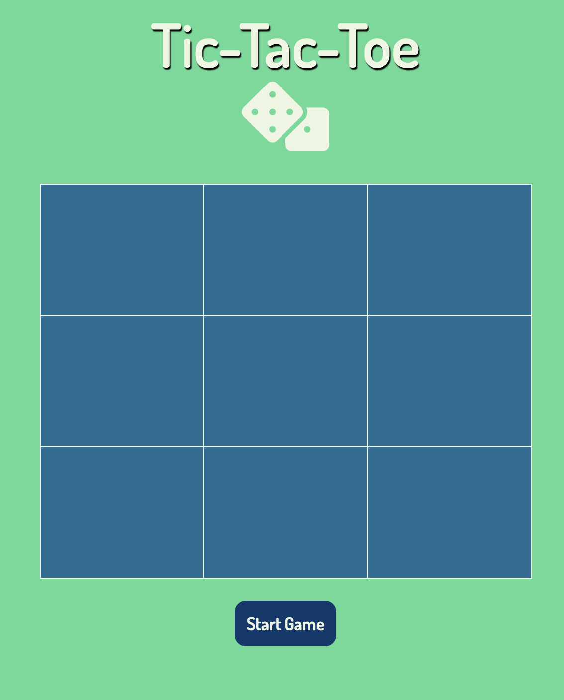
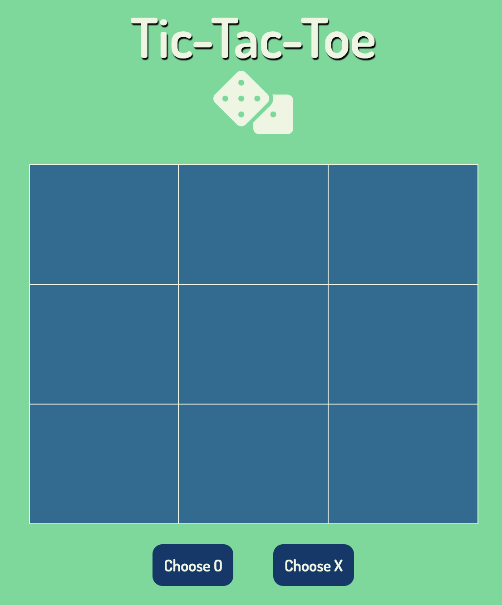
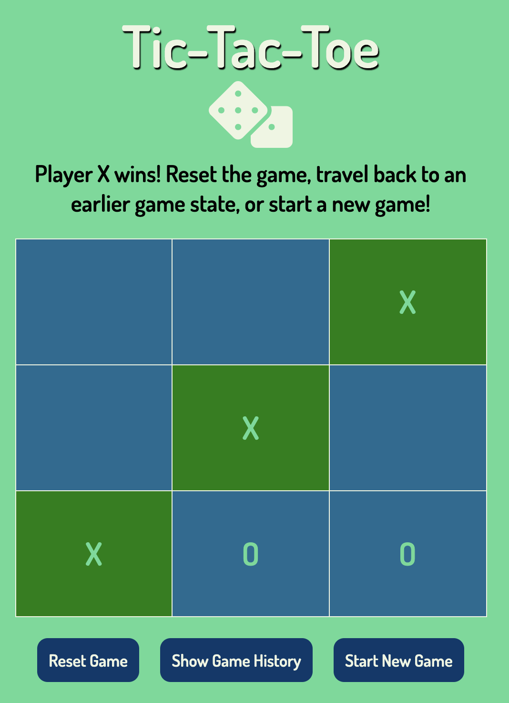
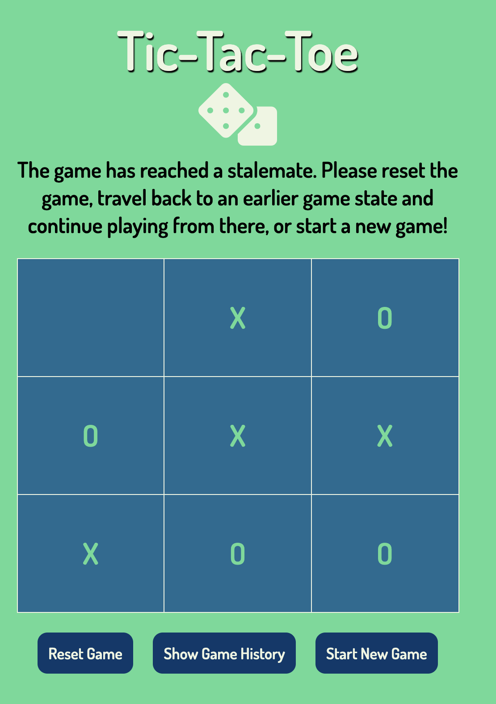
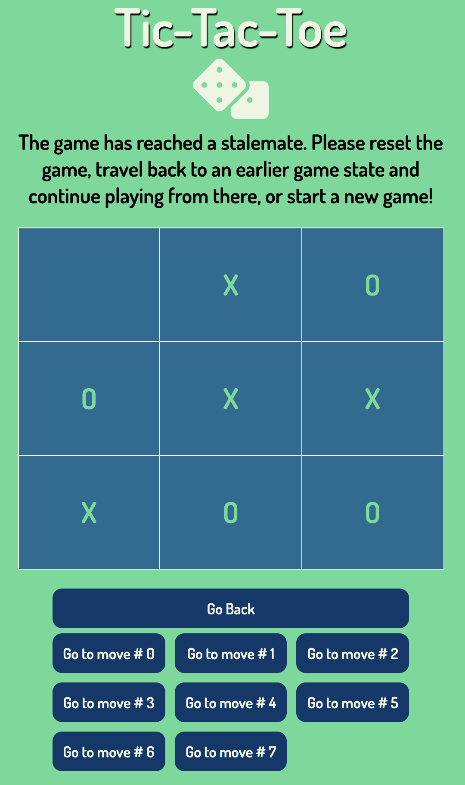
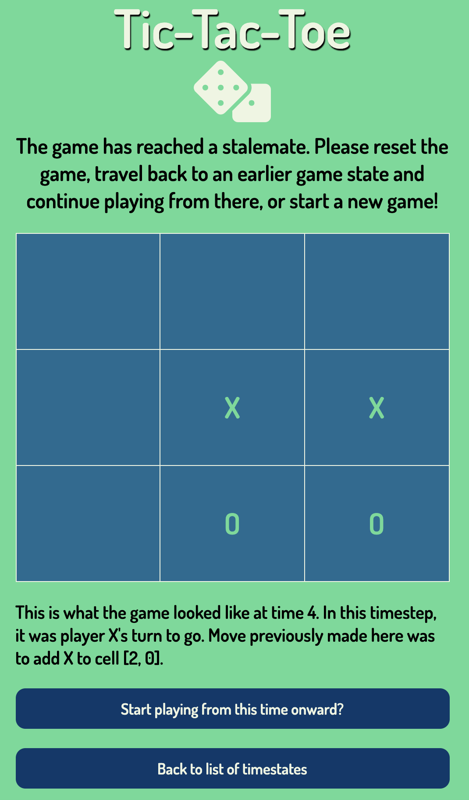
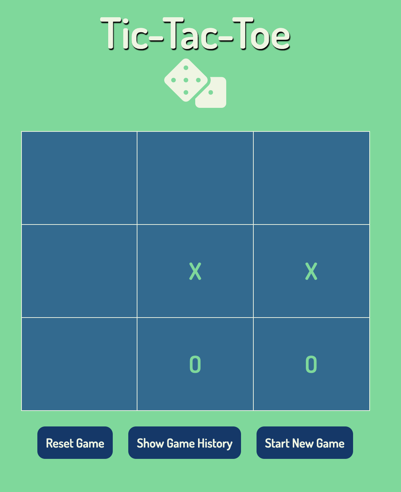

# TicTacToe
This is an application implementing the game TicTacToe I built from the ground up using React and Redux. 

The app can be played on github pages here: 

## Features
* Two player game of tictactoe which ends when any player gets 3 in a row of whatever shape they are using, or the game has reached a stalemate.
* If game is won, three squares that caused win are highlighted and message is displayed indicating player that won 
* If no one can win, message indicating game has reached stalemate is displayed
* App supports the ability to time travel through any of the previous game states, and continue playing on from there

## Screenshots 
Main UI 
  

Selection of which letter to play with
 

 

Highlighting of winning three grid cells and winner message
 

 

Stalemate message
 

 

Being able to select and go back and play from any previous state 
 

 

 

 

 

 

